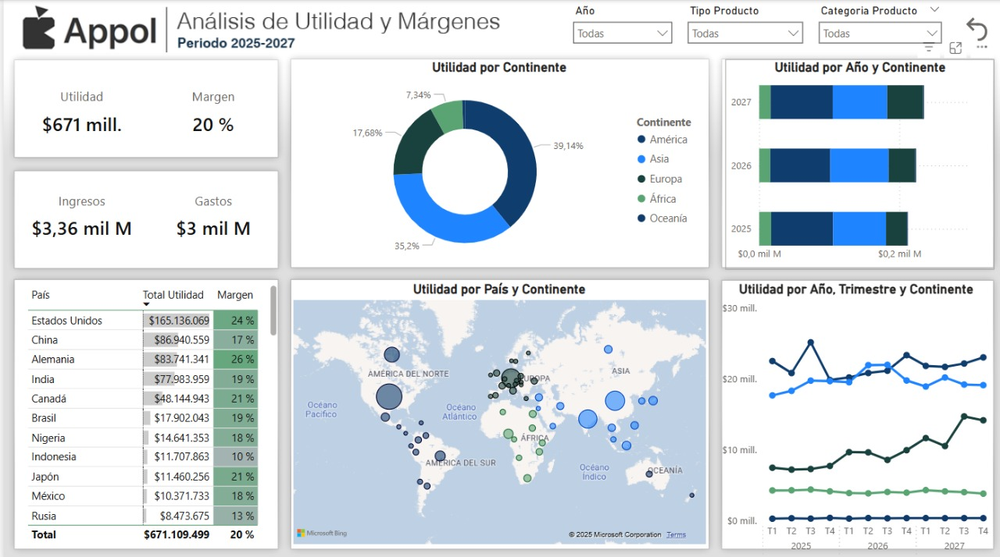

# Panel de Utilidad y Márgenes con Power BI

Dashboard interactivo diseñado para visualizar la utilidad y el margen de diferentes productos, regiones y años. El objetivo es facilitar la toma de decisiones estratégicas en entornos comerciales internacionales.

---

## Tecnologías utilizadas
- **Power BI** – Visualización y análisis de datos
- **Excel** – Fuente de datos estructurada
- **DAX** – Cálculo de KPIs y métricas financieras

## Funcionalidades del dashboard
- Visualización de utilidad total, ingresos, gastos y margen
- Desglose por continente, país, año y trimestre
- Mapas de calor y gráficos dinámicos
- Filtros interactivos por año, tipo y categoría de producto

## Habilidades demostradas
- Modelado de datos y relaciones
- Cálculo de métricas financieras con DAX
- Diseño de dashboards enfocados en claridad y toma de decisiones
- Integración de visualizaciones avanzadas como mapas y gráficos de dispersión

## Notas
> Este proyecto fue construido a partir de un caso real empresarial. Los datos han sido adaptados y anonimizados por motivos de confidencialidad.

## Archivos incluidos
- `bd_utilidad.xlsx` – base de datos anonimizada
- `panel-utilidad.pbix` – dashboard en Power BI
- `imagen-utilidad.png` – visual del panel

---

**Autor:** Juan Camilo Canchala Hernández
